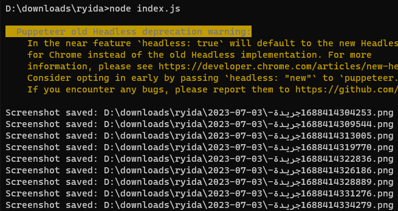
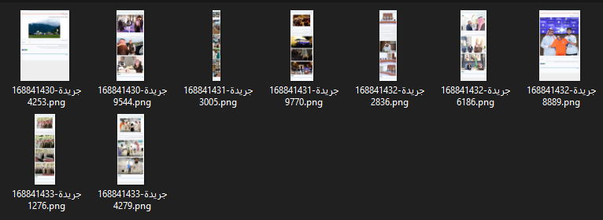
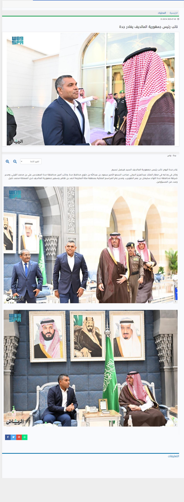

# alriyadhNewsScrapper 

This is a Node.js script that uses Puppeteer to scrape article links from the website "https://www.alriyadh.com/news" and capture full-page screenshots of each article. It also includes an ad blocker plugin to enhance the browsing experience while scraping. 
## How to Use

1. Download The repository or the script file.
2. Install the required dependencies by running the following command:
	  ```shell
	npm install puppeteer puppeteer-extra puppeteer-extra-plugin-adblocker
	  ```
3. Make sure you have Node.js installed on your system.

4. Update the code if needed. For example, you can modify the target URL or customize the script according to your requirements.

5. Run the script by executing the following command:

	```shell
    node script.js
	```
  The script will launch a headless Chrome browser, navigate to the target website, scrape the article links, capture screenshots of each article, and save them in a folder named with the current date.
## Sample outputs

1. **CMD Execution**



This image shows the execution of the script in the command line interface (CMD).

2. **Output Folder**



This image displays the folder where the screenshot outputs or results are saved.

3. **Sample Screenshot**



This image showcases a sample screenshot captured by the script. It provides an example of how the articles are captured and saved as full-page screenshots. Note, it is compressed to be 720*720px.


## Capabilities and Limitations

### Capabilities:
1. The script leverages Puppeteer's capabilities to scrape article links and capture full-page screenshots.
2. It includes an ad blocker plugin, which enhances the browsing experience by blocking ads on the website.
3. The script uses Arabic numeral conversion to rename the screenshots based on the first word of each article title and a timestamp.
4. The screenshots are saved in a folder named with the current date.
5. The script supports the Arabic language by specifying the "ar-SA" language code during navigation.
6. The script sets the viewport size to 1080x1920 pixels for consistent screenshot dimensions.

### Limitations:

1. The script assumes a specific DOM structure and CSS selectors on the target website. If the website structure changes, the script may need adjustments.
2. The script relies on network stability and page load times. In case of slow connections or server issues, it may impact the scraping process.
3. The script captures full-page screenshots, which can be memory-intensive for large articles with extensive content or media.

## Future Work

1. Implement additional error handling and robustness to handle various scenarios and edge cases.
2. Provide options to customize the scraping behavior, such as specifying the number of articles to scrape or filtering articles based on specific criteria.
3. Add support for capturing selective sections or elements within each article instead of full-page screenshots.
4. Enhance the user interface and usability of the script, such as adding command-line arguments or a configuration file for easier customization.

Feel free to contribute to the project by suggesting improvements, reporting issues, or submitting pull requests.
